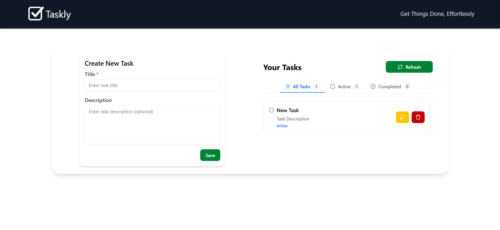
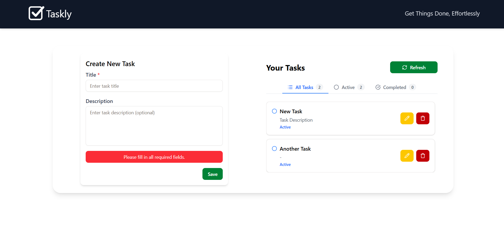
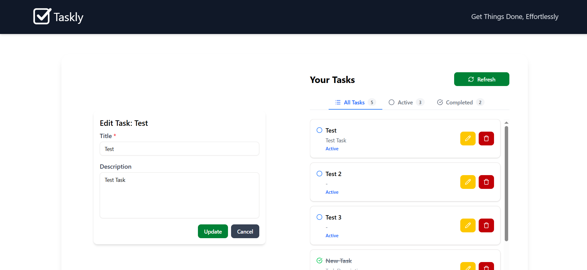
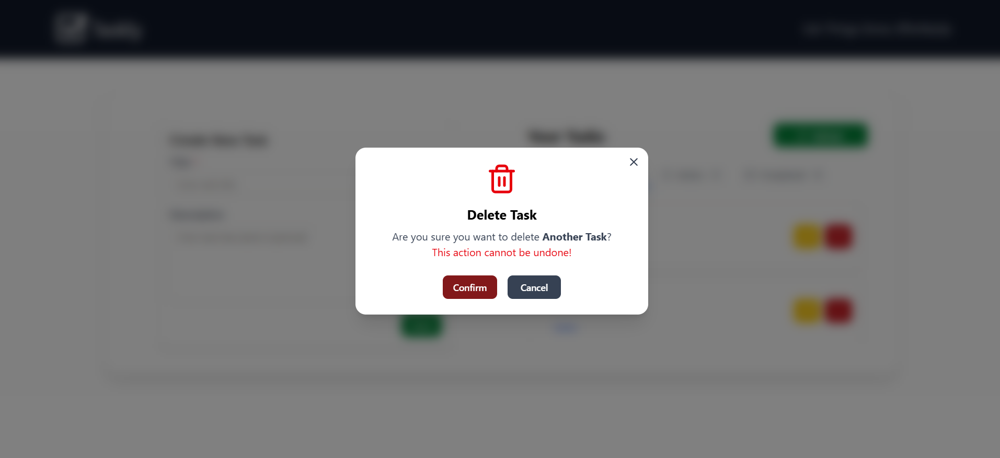
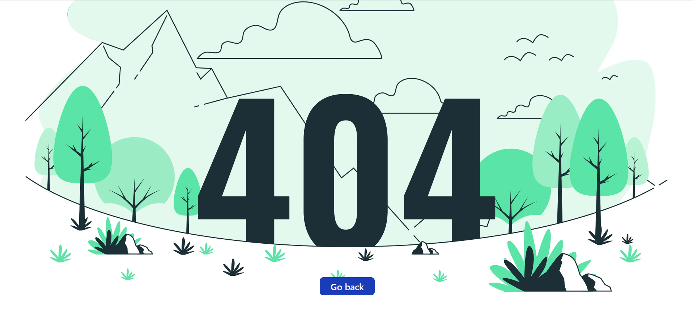

<div align="center">
  <h1="center">MERN Stack Task Tracking Web Applicatino</h1>
  <h4="center">Full Stack Take-home Assignment (Type B Digital)</h4>
</div>








### This project is a MERN stack task tracking web application developed as part of the Type B Digital Full-stack Developer technical assessment. The application focuses on backend functionalities, seamless user interface and provides a robust and secure foundation for an online todo application.

### Key features include task management, and robust data validation with proper response codes and error handling. The backend is designed for scalability and maintainability, providing a solid foundation for a simple task tracking application.

### The application follows a modular and secure architecture with clear separation of concerns, leveraging the MERN stack for scalability and maintainability. It implements a RESTful API with task management, and robust data validation.

### The project includes structured environment configuration for both development and production. Future improvements could include implementing authentication and role based access control, and enhancing frontend-backend interactions.

### Built with

- [![React][React.js]][React-url]
- [![Vite][Vite.js]][Vite-url]
- [![TailwindCss][TailwindCss]][Tailwind-url]
- [![Node][Node.js]][Node-url]
- [![Express][Express.js]][Express.js-url]
- [![MongoDB][MongoDB]][MongoDB-url]
- [![Mongoose][Mongoose]][Mongoose-url]

## Getting started

### Prerequisites

- node.js: [Node.js download page](https://nodejs.org/en/download)
- React.js: [React official website](https://reactjs.org/)
- Vite: [Vite start guide](https://vite.dev/guide/)
- Tailwind CSS: [Tailwind getting stared](https://tailwindcss.com/docs/installation/using-vite)
- Mongo DB: [Mongo DB official website](https://www.mongodb.com/)

### Installation

1. Clone the repo
   ```bash
   git clone https://github.com/CharakaJith/hiring-fullstack-todo.git
   ```
2. Step into the project
   ```bash
   cd hiring-fullstack-todo
   ```
3. Checkout to `develop` branch
   ```
   git checkout develop
   ```

### Environment variables setup

#### Server side

1. Create a `.env.dev` file in root folder
   ```
   New-Item -Path . -Name ".env.dev" -ItemType "File"
   ```
2. Open the `.env` file and update the variables

   ```
   ## environment variables
   ENV=development
   PORT=8000

   ## mongo db
   MONGO_URI=mongodb+srv://<username>:<password>@<cluster-name>-cluster.2bsublg.mongodb.net/<database>
   ```

#### Client side

1. Create a `.env` file in the client folder
   ```
   New-Item -Path . -Name ".env" -ItemType "File"
   ```
2. Open the `.env` file and update the variables
   ```
   ## base url
   VITE_API_BASE_URL=http://localhost:8000 (or the port you have used)
   ```

### Start the project using terminal

1. Install NPM packages
   ```bash
   npm run install:all
   ```
2. Start the server and client
   ```bash
   npm run start
   ```

### Other scripts

1. Start the development server
   ```bash
   npm run dev
   ```
2. Start the client
   ```bash
   npm run client
   ```

## Documentations

- [Postman API documentation](https://documenter.getpostman.com/view/28014836/2sB3WsQLF6)

### Declaration

- This project, including all source code and documentation, was developed by tha author as part of the Type B Digital Full-stack Developer technical assessment.
- ChatGPT was used for minor UI styling suggestions and layout decisions. All backend functionality, including API implementation, database interactions, business logic, as well as the frontend architecture, component logic, state management, API integration, TypeScript implementation, and the overall development approach were independently architected and implemented by the author.

## Contact

Email: [charaka.info@gmail.com](mailto:charaka.info@gmail.com) | LinkedIn: [Charaka Jith Gunasinghe](https://www.linkedin.com/in/charaka-gunasinghe/)

<!-- MARKDOWN LINKS & IMAGES -->

[React.js]: https://img.shields.io/badge/React-20232A?style=for-the-badge&logo=react&logoColor=61DAFB
[React-url]: https://reactjs.org/
[Vite.js]: https://img.shields.io/badge/Vite-646CFF?style=for-the-badge&logo=vite&logoColor=white
[Vite-url]: https://vite.dev
[TailwindCss]: https://img.shields.io/badge/Tailwind_CSS-06B6D4?style=for-the-badge&logo=tailwind-css&logoColor=white
[Tailwind-url]: https://tailwindcss.com/
[Node.js]: https://img.shields.io/badge/Node.js-12A952?style=for-the-badge&logo=node.js&logoColor=white
[Node-url]: https://nodejs.org/en
[Express.js]: https://img.shields.io/badge/Express.js-000000?style=for-the-badge&logo=express&logoColor=white
[Express.js-url]: https://expressjs.com/
[MongoDB]: https://img.shields.io/badge/MongoDB-47A248?style=for-the-badge&logo=mongodb&logoColor=white
[MongoDB-url]: https://www.mongodb.com/
[Mongoose]: https://img.shields.io/badge/Mongoose-880000?style=for-the-badge&logo=mongodb&logoColor=white
[Mongoose-url]: https://mongoosejs.com/
